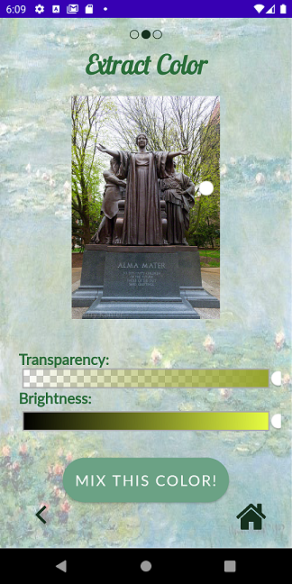
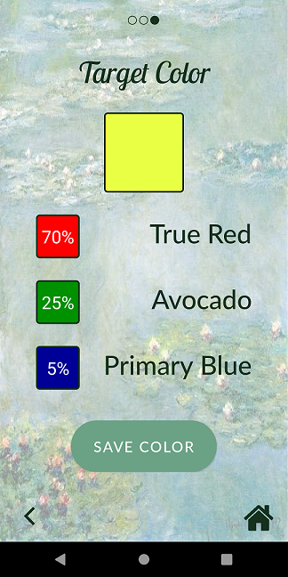
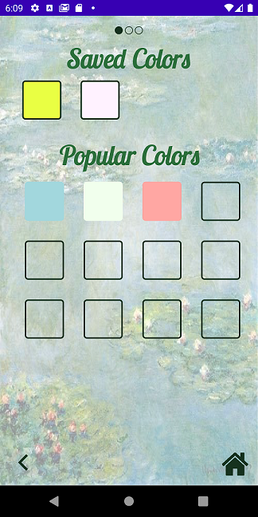

# Palette Provider Mobile Application

### Description

A mobile application that provides paint mixing suggestions to users. 

### Target Users
* Beginner/Amatuer Painters
* Outdoor Painters
* Graphic Designers

### Features
**1. Paint mixing suggestions**
*  Color mixing suggestions are display as a list of colors with the respective percentage needed of each color to mix the target color

**2. Extract target color from different sources**
* Users can choose to select a photo from album to extract the target colors from, or choose to select a color from a HSV color wheel

**3. Save colors for future use**
* The resulting color suggestions can be saved locally by the user for future use
* The saved colors can be accessed from the "Saved Colors" option from the home screen, where a list of popular/common colors are shown for the user's convenience as well

**4. Zoom-in, Adjusting brightness of the photos**
* After picking a photo from the album, the user can choose to zoom in on the photo of choice and/or adjust the brightness of the photo before moving on to extract the desired color to mix

**5. Home button & progress bar**
* The user can go back to the home screen at any step if needed
* A progress bar can be found on the top of the screen to indicate which step the user is at throughout their task

**6. Errors**
* Possible errors include the rare case when the program is unable to extract the color and the user is prompted to try again; or when the lighting of the photo is not good enough for extraction, in this case the user is prompted to try agian as well

### Screenshots

